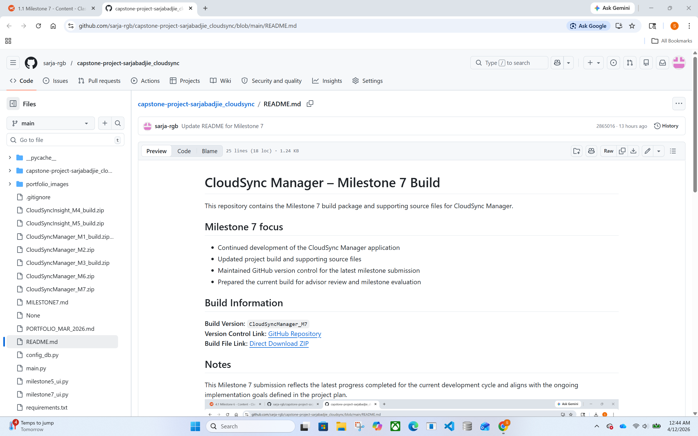

# CloudSync Manager — Milestone 7 Build

This repository contains the **Milestone 7** build package and supporting source files for **CloudSync Manager**.

---

## Milestone 7 focus (Week 1)

This Milestone 7 build demonstrates functional progress toward the CloudSync Manager project goals:

- Working desktop GUI workflow for configuration and demonstration
- SQLite configuration persistence (loads last saved configuration on launch)
- AWS S3 connectivity test via **“Test S3 Connection”**
- Milestone 7 demo UI (**milestone7_ui.py**) showing progress/status and completion state

---

## Build Information

- **Build Version:** `CloudSyncManager_M7`
- **Branch:** `main`
- **GitHub Repository:**  
  https://github.com/sarja-rgb/capstone-project-sarjabadjie_cloudsync

### Direct Build Links

**GitHub Release (Milestone 7):**  
https://github.com/sarja-rgb/capstone-project-sarjabadjie_cloudsync/releases/tag/v0.7-m7

**Direct Download (Release Asset):**  
https://github.com/sarja-rgb/capstone-project-sarjabadjie_cloudsync/releases/download/v0.7-m7/CloudSyncManager_M7.zip

**Build ZIP in Repo (Code tab):**  
https://github.com/sarja-rgb/capstone-project-sarjabadjie_cloudsync/blob/main/CloudSyncManager_M7.zip  
*(Tip: click “View raw” to download.)*

---

## Milestone Notes (Markdown)

Milestone 7 notes and run instructions:  
https://github.com/sarja-rgb/capstone-project-sarjabadjie_cloudsync/blob/main/MILESTONE7.md

---

## Evidence Screenshots (Milestone 7)

### README (Milestone 7 Build)

### GitHub Commit (Milestone 7 UI Demo)

