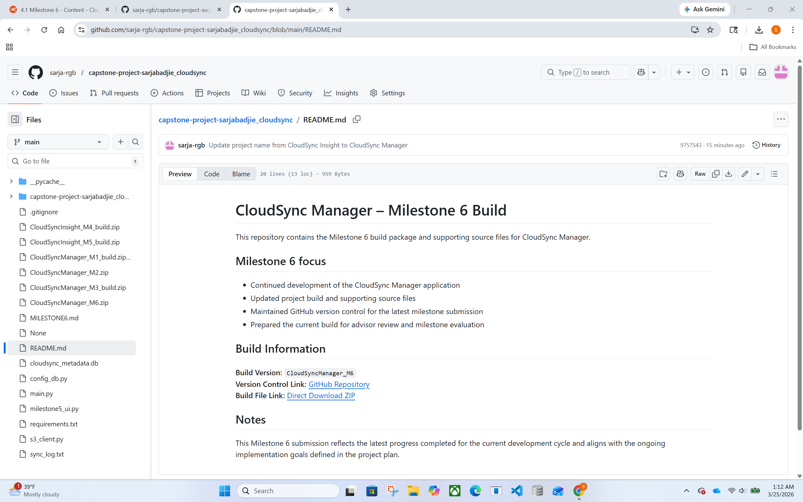
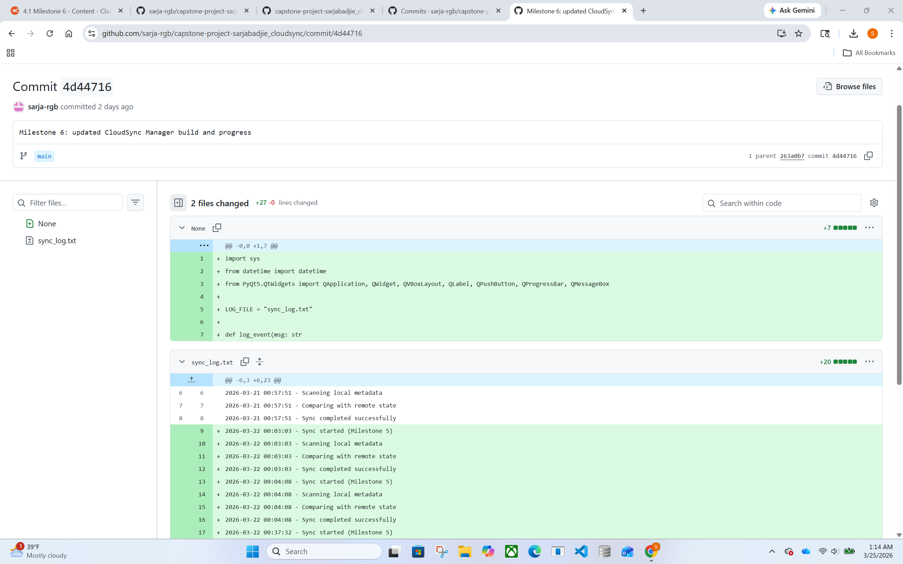

# CloudSync Manager – Milestone 6 Build

This repository contains the Milestone 6 build package and supporting source files for CloudSync Manager.

## Milestone 6 focus

- Continued development of the CloudSync Manager application
- Updated project build and supporting source files
- Maintained GitHub version control for the latest milestone submission
- Prepared the current build for advisor review and milestone evaluation

## Build Information

**Build Version:** `CloudSyncManager_M6`  
**Version Control Link:** [GitHub Repository](https://github.com/sarja-rgb/capstone-project-sarjabadjie_cloudsync)  
**Build File Link:** [Direct Download ZIP](https://raw.githubusercontent.com/sarja-rgb/capstone-project-sarjabadjie_cloudsync/main/CloudSyncManager_M6.zip)

## Notes

This Milestone 6 submission reflects the latest progress completed for the current development cycle and aligns with the ongoing implementation goals defined in the project plan.

## Portfolio Posts (Journal Archive)
- **March 2026:** [CloudSync Manager – Milestone 6 Portfolio Post](PORTFOLIO_MAR_2026.md)
